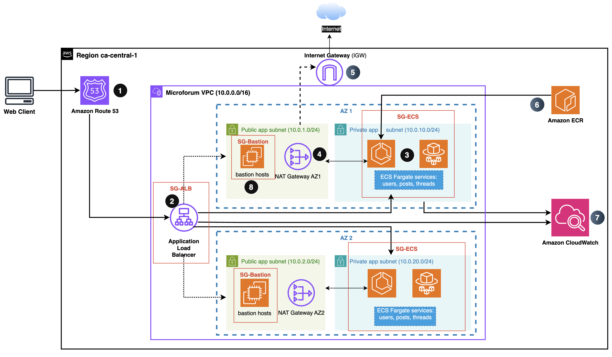
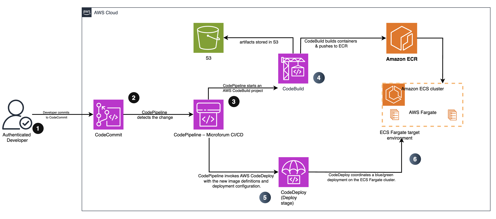

# microforum-ecs-cicd

Cloud-ready deployment of the **Microforum** backend as three independent microservices running on **AWS ECS Fargate**, fronted by an **Application Load Balancer** with path-based routing and deployed via a **CodePipeline → CodeBuild → CodeDeploy** CI/CD pipeline. All core infrastructure is defined with **Terraform**.

The repository demonstrates how to take a small Node.js forum backend and give it a production-style architecture: microservices, containers, CI/CD, and Infrastructure as Code.

---

## 1. Overview

**Microservices**

* `users` – user data and profile operations
* `posts` – forum posts
* `threads` – thread metadata and grouping

Each service:

* Has its own `server.js`, `db.json`, and `Dockerfile`
* Runs locally via Docker Compose
* Deploys as its own ECS Fargate service and ALB target group

**Key characteristics**

* **Microservices**: three services, separate containers, separate target groups
* **Scalable**: ECS Fargate services behind an ALB, ready for auto scaling
* **Resilient**: multi-AZ VPC design with public/private subnets
* **Automated CI/CD**: CodePipeline, CodeBuild, CodeDeploy (ECS blue/green)
* **IaC**: VPC, ECS, ALB, CI/CD stack defined with Terraform

---

## 2. Architecture

### 2.1 Runtime architecture

> 
> 
> 
> 
> 
> 
> 
> 



**Runtime design**

* 1 × **AWS Region** (e.g., `ca-central-1`)
* 1 × **VPC** with:

  * 2 × **public subnets** (one per AZ) – ALB + NAT
  * 2 × **private subnets** (one per AZ) – ECS Fargate tasks
* **Amazon Route 53** – DNS for `microforum.example.com` → ALB
* **Application Load Balancer** – internet-facing, path-based routing:

  * `/users/*` → users target group
  * `/posts/*` → posts target group
  * `/threads/*` → threads target group
* **Amazon ECS (Fargate)** – three services:

  * `users` service (tasks across both AZs)
  * `posts` service
  * `threads` service
* **NAT Gateway + Internet Gateway** – outbound internet from private subnets, inbound via ALB only
* **Amazon ECR** – container images for all three services
* **Security groups**:

  * ALB SG – HTTP from internet, outbound only to ECS SG
  * ECS SG – inbound only from ALB SG on the app port
* **CloudWatch (optional in diagram)** – ECS/ALB logs and metrics

### 2.2 CI/CD pipeline




**Pipeline flow**

* Developer pushes code to **CodeCommit** (or GitHub wired into CodePipeline)
* **CodePipeline** runs:

  * **Source** stage – pull latest commit
  * **Build** stage – **CodeBuild** runs tests and builds Docker images
  * **Deploy** stage – **CodeDeploy** performs ECS blue/green deployment
* **CodeBuild**:

  * Builds images for `users`, `posts`, `threads`
  * Pushes images to **ECR**
  * Writes `imagedefinitions.json` to an **S3 artifacts bucket**
* **CodeDeploy**:

  * Updates ECS services with the new images
  * Creates a new (green) task set
  * Shifts traffic from blue → green via ECS/ALB integration

---

## 3. Repository layout


```bash
microforum-ecs-cicd/
  users/
    Dockerfile
    server.js
    db.json
    package.json
  posts/
    Dockerfile
    server.js
    db.json
    package.json
  threads/
    Dockerfile
    server.js
    db.json
    package.json

  docker-compose.yml        

  infra/
    terraform/
      # VPC, subnets, IGW, NAT, SGs
      # ECS cluster, task defs, services
      # ALB + target groups + listeners
      # ECR repos
      # (optionally) CodePipeline/CodeBuild/CodeDeploy

  buildspecs/
    # buildspec files for CodeBuild

  docs/
    architecture-runtime.png   # runtime diagram (inserted in README)
    architecture-cicd.png      # CI/CD diagram (inserted in README)
    # (optional) additional docs
```

---

## 4. Local development

Run all three microservices locally using Docker Compose.

```bash
# From repo root
docker compose up --build

# Health checks (example ports)
curl http://localhost:3001/health
curl http://localhost:3002/health
curl http://localhost:3003/health
```

Each service also responds at `/` with a simple readiness message for quick smoke-testing.

---

## 5. Deploying to AWS (Terraform)

> Assumes AWS credentials are configured and (optionally) a remote backend (S3 + DynamoDB) is set up.

```bash
cd infra/terraform

terraform init
terraform plan -out tf.plan
terraform apply tf.plan
```

Typical outputs:

* ALB DNS name (public entry point)
* ECS cluster name
* ECS service names for users/posts/threads
* ECR repository URIs

Once applied, the architecture should match the runtime diagram in `docs/`.

---

## 6. CI/CD at a glance

Once the CI/CD stack is provisioned (via Terraform or manually):

1. Push to `main` (or your chosen branch).
2. **CodePipeline** pulls the commit from the repo and triggers **CodeBuild**.
3. **CodeBuild** builds and tags images for all three services, pushes them to **ECR**, and uploads `imagedefinitions.json` (and other artifacts) to **S3`.
4. **CodeDeploy** updates ECS services with the new images (blue/green) and shifts traffic on success.

This provides a repeatable, auditable path from commit → container → running tasks on ECS.

---

## 7. Capabilities summary

| Area                     | How it is addressed                                                         |
| ------------------------ | --------------------------------------------------------------------------- |
| Design                   | Runtime + CI/CD diagrams in `docs/`, referenced in README                   |
| Cost & efficiency        | Fargate instead of fixed EC2, shared ALB, multi-AZ with right-sizing        |
| Microservices            | Separate `users`, `posts`, `threads` services and target groups             |
| Portability              | Docker images, `docker-compose.yml` for local dev, ECS in production        |
| Scalability & resilience | Multi-AZ, ALB + health checks, ECS services ready for auto scaling          |
| Automated delivery       | CodePipeline → CodeBuild → CodeDeploy pipeline definition (infra/terraform) |
| Infrastructure as Code   | Terraform for VPC, ECS, ALB, ECR, and CI/CD resources                       |

---

## 8. Notes

* The focus here is backend and platform: ECS, networking, CI/CD, and observability.
* Frontend or additional data stores (for example, RDS/DynamoDB instead of `db.json`) can be added on top of the same pattern without changing the core deployment model.

---

## 9. Maintainer

Maintained as a demonstration of production-style AWS microservices and DevOps practices.

* GitHub: [https://github.com/devtalent2030](https://github.com/devtalent2030)
# tiny trigger Sun  7 Dec 2025 19:32:21 EST
